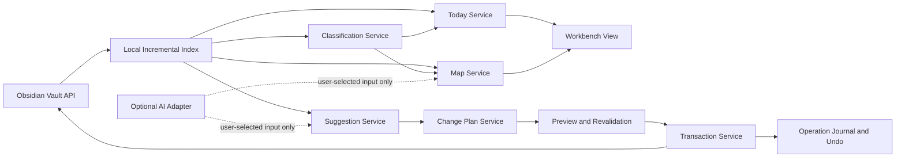

# Obsidian Knowledge Workbench Design

- Status: Approved product design
- Date: 2026-07-12
- Working name: Knowledge Workbench / 知识工作台
- Plugin ID: `knowledge-workbench`
- MVP support target: Obsidian Desktop 1.12.7 on macOS
- MVP mobile policy: desktop-only plugin; mobile Obsidian must continue reading the vault normally without this plugin

## 1. Problem and evidence

The current vault is difficult to understand because several kinds of complexity overlap:

- 3,466 Markdown files are visible, and about 99% are imported reference material rather than personal notes.
- 194 duplicate-title groups involve 1,578 files, including many `README.md` and `SKILL.md` files.
- 30 community plugin directories exist and 26 are enabled; all 31 configured core plugins are enabled.
- Navigation, graph, AI, synchronization, and import functions overlap across multiple plugins.
- The saved workspace contains 23 leaf views, including 12 panels on the right side.
- Only a small share of notes use frontmatter, tags, or explicit Wikilinks, so the visual graph tools have little intentional structure to work with.

The product must not blame the user for this complexity. Its job is to create a calm entry point over the existing vault while preserving the user's ownership of every file and structural decision.

## 2. Product thesis

Knowledge Workbench is a local-first Obsidian view with two equally important panes:

1. **Today** answers “What should I do next?”
2. **Knowledge Map** answers “Where is this knowledge, and how is it related?”

The plugin separates personal notes from imported reference material, but allows explicit and suggested relationships between them. It can propose organization changes, but it cannot change a file until the user previews and confirms a concrete change plan.

## 3. Goals

1. Replace the initial wall of folders and panels with one understandable workbench.
2. Keep “My Notes” and “Reference Library” visibly distinct without isolating them from each other.
3. Make local, explainable signals sufficient for the core experience.
4. Treat AI as an optional enhancement for summaries, topic names, and relation explanations.
5. Make every plugin-proposed structural mutation explicit, previewable, journaled, and reversible.
6. Keep Markdown usable if the plugin is disabled or removed.

## 4. Success criteria

The MVP succeeds when all of the following are true:

- A user can open the workbench and identify a next action within 10 seconds.
- A user can find a topic and see both personal notes and supporting references within 3 minutes.
- No move, rename, or frontmatter update happens without a preview and confirmation.
- A confirmed operation can be safely undone after restarting Obsidian, provided the target has not changed; changed targets require a new undo preview.
- With AI disabled and the network unavailable, indexing, Today, the map, suggestions, previews, execution, and undo still work.
- A 5,000-note fixture indexes within 30 seconds on the target Mac, and a single-note incremental update completes within 1 second.

The 10-second and 3-minute criteria are measured in a short usability session after a valid initial index exists. Performance criteria are measured by automated benchmarks on the user's target Mac.

## 5. Non-goals for the MVP

The first release will not:

- permanently delete files;
- merge note bodies;
- overwrite an existing same-name file;
- automatically reorganize the vault without confirmation;
- enable, disable, uninstall, or configure other community plugins;
- replace Obsidian Sync, Git, or any other synchronization system;
- render a full-vault 3D graph;
- become a task manager, calendar, or general-purpose project manager;
- provide the full workbench on mobile;
- upload or embed the full vault in the background;
- depend on Dataview, Tasks, Templater, or another community plugin.

## 6. Core experience

### 6.1 Entry points

The plugin provides:

- a ribbon icon that opens the workbench in the main area;
- a command-palette command, “Open Knowledge Workbench”;
- an optional setting to open the workbench at Obsidian startup, disabled by default.

The plugin is a workspace view, not a replacement editor. Opening a note from either pane uses Obsidian's normal editor.

### 6.2 Workbench layout

The main view is a desktop split layout:

```text
┌─────────────────────────────── Knowledge Workbench ───────────────────────────────┐
│ Workbench | Organization Suggestions | Operation History | Settings              │
├─────────────────────────────┬─────────────────────────────────────────────────────┤
│ Today                       │ Knowledge Map                                       │
│                             │                                                     │
│ My Notes | Reference Library│ All | My Notes | Reference Library                  │
│ - New items to organize     │                                                     │
│ - Continue where I stopped  │ Focused topic map, maximum 50 visible nodes         │
│ - One explained next action │ Selected-node details and relationship reasons      │
│ - Quick capture             │                                                     │
└─────────────────────────────┴─────────────────────────────────────────────────────┘
```

The two panes have equal product importance. On narrower desktop windows, they stack vertically instead of shrinking into unreadable columns.

### 6.3 Today pane

Today shows a limited, explainable queue rather than an infinite feed. Each group displays at most seven items.

The initial groups are:

- **New and unclassified:** recently added notes with no confirmed kind or topic.
- **Continue:** recently opened or edited notes that the user has not dismissed.
- **Next suggestion:** the highest-value organization or linking suggestion, with a visible reason.
- **Quick capture:** create a normal Markdown note first and classify it later.

Every recommendation shows why it appeared. Local factors include explicit pinning, recency, unclassified status, and unresolved high-confidence suggestions. AI output cannot silently change Today ranking.

Pin and dismiss actions are workbench UI state stored locally; they do not write to Markdown. A dismissal expires when the note changes or after 30 days, whichever comes first. Quick Capture is an explicit user action implemented through a narrow public-API adapter: a modal asks for a title, confirms the collision-free Markdown path, creates one blank note with Obsidian's public Vault API, and opens it in the normal editor. It does not add metadata or trigger an organization mutation until the user separately confirms a change plan.

### 6.4 Knowledge Map pane

The map is focused, not global. It shows at most 50 nodes around the selected topic, note, or search result.

Node types remain distinguishable by label and shape as well as color:

- personal note;
- reference note;
- topic cluster;
- inferred relation;
- confirmed relation.

The user can filter to all content, personal notes, or reference material. Selecting a node opens a details panel with its path, topics, connected notes, and a plain-language explanation for each inferred relation.

Local relation signals, ordered from strongest to weakest, are:

1. explicit Wikilinks;
2. confirmed topic properties;
3. shared tags and compatible frontmatter values;
4. folder and source proximity;
5. normalized overlap in titles, headings, and local text tokens.

The map does not require embeddings. Optional AI can rename a cluster, summarize a selected cluster, or explain a candidate relation only after a user action.

### 6.5 Organization Suggestions

Suggestions are sorted by confidence and impact. The MVP can suggest only these operation types:

- move a Markdown file;
- rename a Markdown file;
- set or update a plugin-owned frontmatter field;
- add a confirmed related-note Wikilink to a plugin-owned frontmatter field.

It may detect possible duplicate bodies, empty files, and unused structures, but those appear as informational findings. The MVP never produces delete or body-merge operations.

### 6.6 Change Preview

The preview must show:

- every selected operation;
- old and proposed paths;
- proposed frontmatter differences;
- affected internal links;
- same-name, missing-file, and invalid-path conflicts;
- the local or AI-enhanced reason for each suggestion;
- the exact number of files affected;
- which actions can be undone.

The user can deselect individual operations. Cancel leaves the vault unchanged.

For a move or rename with inbound links, the preview lists every affected source note and blocks the operation. The supported public API does not expose a reliable automatic-link-update capability check, so the MVP neither reads private configuration nor rewrites note bodies itself. A move or rename is executable only when the current index reports zero inbound links.

### 6.7 Operation History

The plugin retains the latest 100 successful or partially recovered change plans locally. Each entry contains:

- the confirmed plan;
- precondition hashes and timestamps;
- completed operations;
- inverse operations;
- rollback or recovery results;
- user-visible status.

History can be exported as readable JSON. Clearing history requires a separate confirmation and never changes notes.

## 7. Content boundaries and durable metadata

### 7.1 Personal notes versus reference material

Classification follows this precedence:

1. an explicit per-note `knowledge-workbench-kind` property;
2. the first matching user-configured folder rule;
3. an unclassified state.

Valid explicit values are `note` and `reference`. The onboarding scan proposes folder rules but does not write them to notes. For the current vault, imported roots are presented as candidate reference-library roots; the user confirms or changes them.

Hidden configuration directories, attachment formats, plugin caches, and user-defined excluded paths are not indexed as notes.

### 7.2 Plugin-owned frontmatter

Confirmed durable structure uses readable Markdown properties:

```yaml
knowledge-workbench-kind: note
knowledge-workbench-topics:
  - AI tools
knowledge-workbench-related:
  - "[[Graphify project guide]]"
```

The plugin previews every property change. It preserves unrelated frontmatter fields and formatting to the extent supported by Obsidian's frontmatter API.

Inferred topics and relations remain cache data. They become durable only when the user explicitly confirms a frontmatter write. This keeps Markdown as the durable source of truth for user-authored knowledge while allowing experimentation without file churn. Local pins, dismissals, settings, and operation journals are operational plugin state rather than knowledge content.

## 8. Architecture



### 8.1 Component responsibilities

| Component | Responsibility | Must not do |
| --- | --- | --- |
| `WorkbenchView` | Compose Today, map, suggestions, history, and settings UI | Read or mutate files directly |
| `IndexService` | Scan Markdown, watch vault events, store derived records | Upload content or decide organization changes |
| `ClassificationService` | Apply explicit kind and ordered folder rules | Move files |
| `TodayService` | Rank a small queue with visible reasons | Depend on AI or mutate notes |
| `MapService` | Build focused topic and relation subgraphs | Render the entire vault by default |
| `SuggestionService` | Produce explainable candidate operations | Execute candidates |
| `ChangePlanService` | Resolve operations, impacts, conflicts, and preconditions | Bypass preview or confirmation |
| `TransactionService` | Revalidate and execute one confirmed plan | Execute stale, conflicting, or oversized plans |
| `OperationJournal` | Persist completed and inverse operations | Treat an unsafe inverse as automatically executable |
| `AiEnhancementService` | Provide optional summaries, names, and explanations | Run without opt-in or send the full vault |
| `SettingsStore` | Persist folder rules, excludes, limits, and AI preferences | Store API keys as plaintext |
| `QuickCaptureAdapter` | After its own modal confirmation, create one blank collision-free Markdown note and open it | Add frontmatter, choose organization, overwrite, or perform batch writes |

Each component exposes typed inputs and outputs so its behavior can be tested without loading the entire UI.

## 9. Local index and data model

The raw Markdown body is not duplicated in the persistent index. The index stores derived fields and can be deleted and rebuilt.

| Record | Key fields |
| --- | --- |
| `DocumentRecord` | path, kind, title, aliases, headings, tags, selected frontmatter, outgoing links, normalized local tokens, modified time, content hash |
| `TopicCluster` | stable derived ID, display label, member document IDs, contributing signals, confidence |
| `RelationCandidate` | source ID, target ID, signal breakdown, confidence, optional explanation, inferred or confirmed status |
| `ChangePlan` | plan ID, creation time, vault revision, operations, preconditions, impact summary, conflicts |
| `JournalEntry` | plan snapshot, completed steps, inverse steps, rollback status, final status |
| `PluginSettings` | folder rules, excludes, queue limits, node limit, write lock, AI opt-in and endpoint metadata |

One schema-versioned plugin data document, managed through Obsidian's `Plugin.loadData()` and `Plugin.saveData()` APIs, contains three logical stores with separate lifecycles:

- an **active derived index** that the UI may read and that can always be rebuilt from Markdown;
- a **staging index and scan checkpoint** used only to resume an interrupted initial scan, never exposed as a complete result;
- **operational state** for settings, pins, dismissals, the write lock, and the last 100 journal entries.

The initial scan reports progress and is cancellable. A completed staging index is atomically promoted to the active index. After the scan, Obsidian vault events are debounced and processed incrementally. Creating, modifying, renaming, moving, or deleting a Markdown file invalidates only affected records and neighboring relations.

## 10. Write safety and transactions

### 10.1 Read-only default

New installations begin in read-only mode. Workbench, indexing, map, and suggestions work immediately. The user must explicitly enable write operations in settings after reviewing a sample plan.

The write lock governs organization transactions proposed by the plugin. Quick Capture remains available because it is a direct, separately confirmed user action with only the capability to create one collision-free blank Markdown note and open it; while the lock is active, the plugin cannot attach metadata or perform any follow-up organization write.

### 10.2 Plan limits and preconditions

- A plan contains at most 50 atomic operations; each move, rename, frontmatter update, or confirmed-link write counts as one operation.
- Every file operation records its source path, modified time, and content hash.
- Every target path is checked for collisions and invalid characters.
- A move or rename with one or more inbound links is blocked before confirmation.
- The complete plan is revalidated immediately before execution.
- If any required precondition is stale, the plan expires and no operation runs.

### 10.3 Execution and rollback

The transaction service executes a confirmed plan sequentially through Obsidian APIs and journals each completed step.

- On success, inverse operations are retained for undo.
- On failure, remaining operations stop and completed steps roll back in reverse order.
- If rollback is incomplete, the plugin displays and exports a recovery report with original paths and unresolved steps.
- The plugin never hides a failed or partially recovered plan as successful.

### 10.4 Undo

Undo is another previewed plan. If a target changed after the original operation, undo shows the drift and allows only still-safe inverse steps. It never overwrites later edits to force a historical state.

## 11. Optional AI boundary

AI is disabled by default. The first release supports one user-configured OpenAI-compatible endpoint and model.

Permitted AI actions are:

- summarize notes selected by the user;
- suggest a display name for the selected topic cluster;
- explain why selected notes may be related;
- propose organization labels for a selected set.

Before a request, the UI shows which notes are included and the approximate character count. A single request may include at most 20 notes and 100,000 characters; larger selections must be narrowed by the user. Background full-vault upload is prohibited. AI responses are labeled as suggestions and cannot execute changes.

Credentials must use secure secret storage exposed by the supported Obsidian build. If secure persistence is unavailable, the key is session-only; plaintext persistence is not an allowed fallback. Logs must redact credentials and request authorization headers.

Timeouts, rate limits, authentication failures, and malformed responses degrade to local behavior. One automatic retry is allowed only for transient network or server errors.

## 12. Error handling

| Condition | Required behavior |
| --- | --- |
| Initial scan interrupted | Keep any checkpoint only in the staging store; resume or restart without promoting it to the active index |
| Note changes during analysis | Invalidate affected suggestions and recompute |
| Plan changes after preview | Expire the plan and require a new preview |
| Target name already exists | Block the operation and propose non-destructive alternatives |
| Source note is missing | Block the plan; never infer that missing means deleted intentionally |
| Execution fails partway | Stop, roll back completed steps, and show the journal result |
| Rollback fails partway | Preserve a recovery report and require manual review |
| AI unavailable | Keep all local features working and label AI actions unavailable |
| Sync software changes a file | Treat it as ordinary vault drift and revalidate before writing |
| Plugin is disabled or removed | Leave standard Markdown and attachments readable and unchanged |

## 13. Performance, usability, and accessibility

- Initial 5,000-note indexing target: at most 30 seconds on the user's target Mac using a fixture with at least 75 MiB of Markdown.
- Single-note incremental update target: at most 1 second at the 95th percentile across 100 updates of Markdown files up to 64 KiB.
- Workbench becomes interactive within 2 seconds at the 95th percentile across 20 opens when a valid index exists.
- Long scans and map calculations expose progress and cancellation.
- Map rendering caps visible nodes at 50 and virtualizes long result lists.
- Today limits each group to seven items and supports dismissal.
- Every primary action is keyboard reachable.
- Focus order, button names, and status announcements support screen readers.
- Kind and relation states use text or shape in addition to color.
- The view supports Obsidian light and dark themes and respects reduced-motion settings.

## 14. Testing strategy

### 14.1 Unit tests

Unit tests cover:

- Markdown-derived record extraction;
- ordered folder rules and per-note overrides;
- Today ranking and explanation generation;
- relation signal weights and focused-subgraph selection;
- path validation and same-name detection;
- plan preconditions and expiry;
- inverse-operation generation;
- AI payload scoping and credential redaction.

### 14.2 Integration tests

A fixture vault includes Chinese and English names, duplicate titles, explicit links, malformed frontmatter, empty files, long paths, attachments, and case-collision scenarios.

Integration tests cover:

- initial scan and incremental create, modify, rename, move, and delete events;
- deterministic rebuild after cache deletion;
- preview accuracy for paths, properties, and link impact;
- blocking move and rename plans whenever the source has inbound links;
- no writes before confirmation;
- stale-plan rejection;
- successful execution and restart-persistent undo;
- partial execution failure and full rollback;
- simulated rollback failure and recovery report;
- offline operation with AI disabled;
- AI timeout and malformed-response fallback.

### 14.3 Performance tests

A generated 5,000-note fixture with at least 75 MiB of Markdown provides repeatable indexing and incremental-update benchmarks. Performance tests record machine information, note count, content size, elapsed time, and peak memory so regressions are visible rather than hidden by a single pass/fail number.

### 14.4 UI and acceptance tests

UI tests cover split and stacked layouts, theme compatibility, keyboard traversal, focus restoration after modals, and accessible status announcements.

Acceptance on the real vault occurs in this order:

1. Install with write operations locked.
2. Complete a read-only scan and review classification rules.
3. Validate Today and the focused map against known notes.
4. Preview several organization plans without executing them.
5. Unlock writes and execute one single-file plan.
6. Verify restart-persistent undo.
7. Increase batch size gradually to 10 and then the maximum of 50.
8. Enable AI only if the local experience is already acceptable.

Real vault contents and snapshots are never committed to the project repository.

## 15. Release boundary

The MVP is complete only when the core local flow passes automated tests and the read-only real-vault acceptance steps. AI integration is part of the MVP interface, but an unavailable AI service cannot block release of the local core.

Compatibility expansion below Obsidian Desktop 1.12.7 or beyond macOS requires a separate tested release decision. The initial manifest uses `minAppVersion: 1.12.7` and `isDesktopOnly: true` rather than claiming untested compatibility.

## 16. Confirmed product decisions

- Today and Knowledge Map are both required and share the main view.
- The chosen layout is an equal split, not a hidden secondary map.
- Personal notes and reference material are separate but linkable.
- Changes require preview and confirmation.
- The core is local-first and AI is optional.
- Markdown remains the durable source of truth.
- The MVP is desktop-first and non-destructive.
- The chosen product scope is a reversible knowledge workbench, not a fully automatic knowledge operating system.
